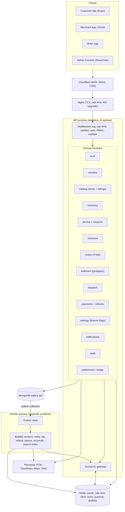
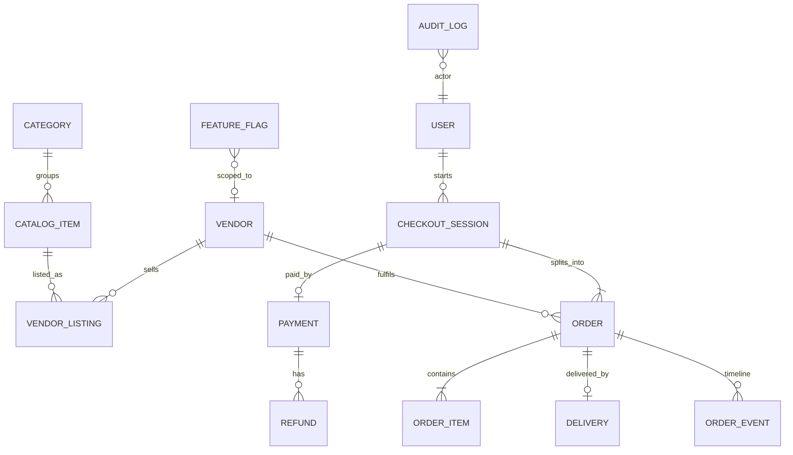
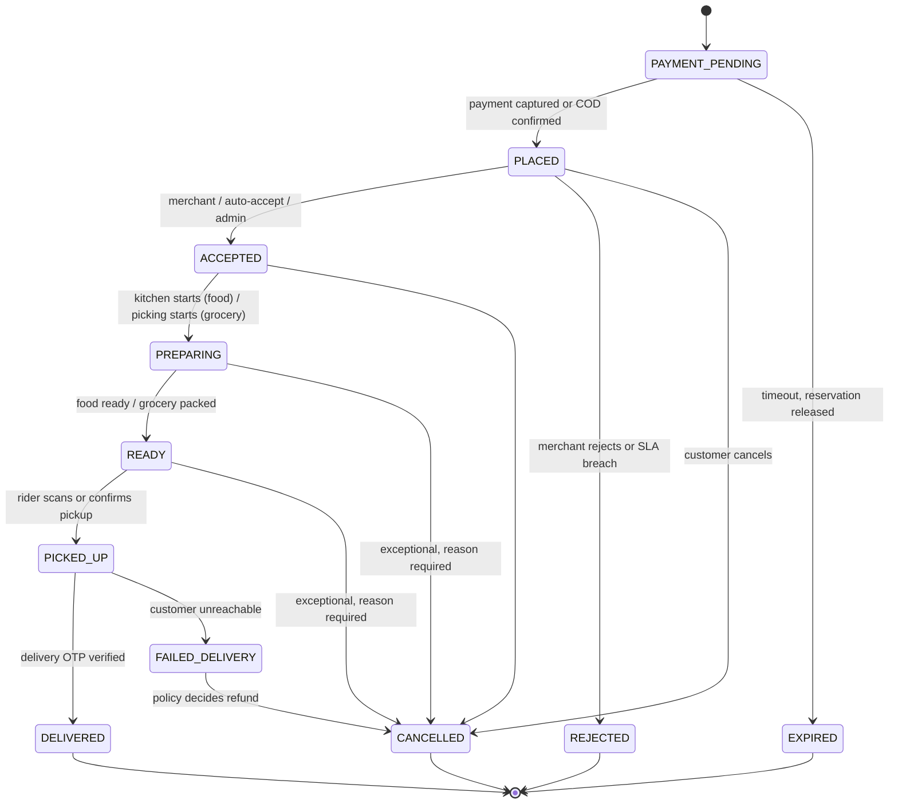
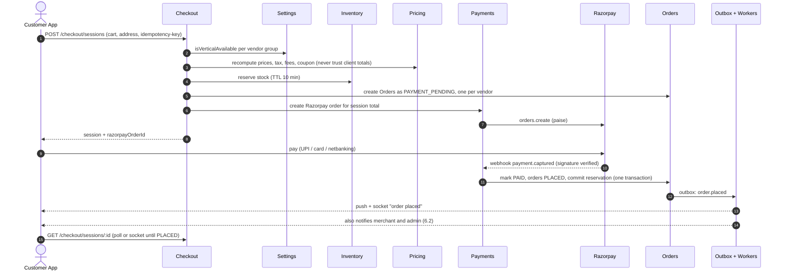
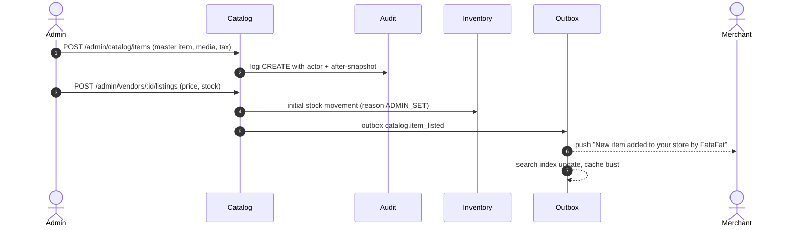

# FataFat — Architecture & Workflow Specification v2

Food + Grocery on one platform: one catalog model, one order pipeline, one admin console, one switch per vertical.

Stack stays as is: React Native (Expo), Node.js/Express modular monolith, MongoDB, Redis, Socket.IO, BullMQ. No microservices. The changes are in the domain model, the order/payment flow, and the control plane (admin, flags, notifications).

---

## 0. What changes vs v1

| # | Change | Why |
|---|---|---|
| 1 | Grocery gets a real fulfilling entity (`Vendor` of type `dark_store` / `grocery_store`) | In v1 a grocery order has no `restaurantId`, so nobody owns it, nobody gets the alert, nobody packs it |
| 2 | Unified catalog: `CatalogItem` + `VendorListing` | Food and grocery share category, media, tax, search, pricing and stock code. Admin adds once, assigns to many vendors |
| 3 | One `orders` collection, `vertical` field decides behaviour | Single order list for admin, support, finance, analytics |
| 4 | `CheckoutSession` (1 payment) to N `Order` (one per vendor) | Mixed food + grocery cart works without hacks |
| 5 | Order is created before payment, confirmed by webhook | v1 trusts the client's "payment done" call. Webhook must be the source of truth |
| 6 | Three independent status tracks: order, payment, delivery | v1 mixes refund into order status (`DELIVERED -> REFUNDED`), which breaks reporting |
| 7 | Stock reservation with TTL | v1 has only `stockQuantity`, which oversells under concurrency |
| 8 | Vertical switch (`food` / `grocery`) at global, city/zone and vendor level | Admin kill-switch with drain mode |
| 9 | Admin is a first-class actor: can create/edit catalog, vendors and orders, gets order alerts, every action audited | Requirement |
| 10 | Transactional outbox for events | No lost notifications / inconsistent state when the process dies mid-request |
| 11 | Dispatch engine instead of "broadcast to everyone" | Faster assignment, fewer rider conflicts, reassignment on timeout |

---

## 1. Review of the current design

### What is solid (keep)
- Modular monolith with the "no cross-module model access" rule. Correct for this stage.
- Middleware order (logger, rate limit, sanitize, auth, RBAC, Zod) is right.
- Integer paise pricing, hashed refresh tokens with reuse detection, Redis socket adapter, BullMQ for side effects.
- FSM in a dedicated file.

### Gaps found

| Severity | Gap | Fix in v2 |
|---|---|---|
| Critical | Order created after client sends payment proof. Client can skip the call, order lost while money is captured | Section 5.2: server-created order, webhook confirms, reconciliation job |
| Critical | No stock reservation, `stockQuantity` decrement not atomic | Section 4.4: conditional atomic update + reservation TTL |
| Critical | Grocery has no merchant. ERD: `restaurantId` optional | Vendor abstraction (3.1) |
| High | Cart "single restaurant" rule blocks food + grocery together | Per-vendor cart groups, one checkout, split orders |
| High | Refund inside order FSM | Separate `payment.status` and `Refund` entity |
| High | `READY_FOR_PICKUP` triggers rider broadcast, so rider search starts only after food is ready, customer waits extra | Dispatch starts early, timed against prep time (5.5) |
| High | Admin cannot act on orders/catalog, no audit trail | RBAC permissions + `AuditLog` (7) |
| Medium | No SLA timers: merchant ignores order, order sits in `PENDING` | Delayed BullMQ jobs with escalation (5.6) |
| Medium | Rider GPS every 5-10s written through app server | Redis GEO + throttled persistence (6.3) |
| Medium | No feature flags / kill switch | Section 4 |
| Medium | Notifications are ad-hoc per module | Event bus + notification matrix (6.2) |
| Low | MongoDB transactions not mentioned | Run replica set (even single-node RS on VPS) so multi-document transactions work |

---

## 2. Target architecture



Rules that go with the diagram:

1. API and workers are separate containers from the same codebase. A slow payout job must never block order placement.
2. Every state change that has side effects writes an **outbox** row in the same Mongo transaction. The relay publishes it to BullMQ. No "save then emit" in controllers.
3. Modules talk through service functions or domain events only. Mongoose models stay private to the module.
4. Redis is a cache and coordination layer, never the source of truth for money or orders.

---

## 3. Domain model



### 3.1 Vendor (replaces Restaurant)

```
Vendor {
  type:        'restaurant' | 'grocery_store' | 'dark_store'
  vertical:    'food' | 'grocery'            // derived from type, indexed
  ownership:   'merchant' | 'platform'       // platform = run by FataFat / admin team
  ownerId, staff: [{ userId, role: 'manager'|'picker'|'cashier' }]
  location: GeoJSON Point (2dsphere), address, zoneIds: [ObjectId]
  serviceRadiusM, hours[], isOpen, isActive, pausedUntil, pauseReason
  approval: { status, kybDocs, reviewedBy, reviewedAt }
  commission: { percent, flatPaise }
  prepTime: { avgMin, p90Min }               // updated by job from real order data
  autoAccept: boolean                        // recommended ON for dark stores
}
```

`ownership: 'platform'` is how the admin sells grocery without a third-party merchant: the admin team operates a dark store, and its pickers are `staff`.

### 3.2 Catalog: item vs listing

- `CatalogItem` = what the thing is. Name, images, category, attributes, tax (HSN/GST %), veg flag, barcode, brand.
- `VendorListing` = who sells it and at what price. `vendorId`, `itemId`, `pricePaise`, `mrpPaise`, `stock`, `isAvailable`, variants and addons, `sortOrder`.

```
CatalogItem {
  kind: 'dish' | 'sku',  vertical,  scope: 'vendor' | 'master',
  vendorId?            // set when scope = 'vendor' (restaurant dishes)
  categoryId, brandId?, name, slug, description, media[], tags[], searchTerms[]
  attributes { isVeg, spiceLevel, unit, unitSize, barcode, shelfLifeDays }
  tax { hsn, gstPercent }
  status: 'draft' | 'active' | 'archived'
  createdBy: { userId, role }, version
}

VendorListing {
  vendorId, itemId, vertical,
  pricePaise, mrpPaise,
  variants[], addonGroups[],                // food customisation
  stock { track: bool, available, reserved, reorderLevel }   // grocery: track = true
  isAvailable, availableFrom/To (menu timing), maxQtyPerOrder
  version                                   // optimistic concurrency
}
```

How it plays out:

- **Restaurant dish**: merchant creates a dish, system creates `CatalogItem(scope=vendor)` and a listing in one transaction.
- **Grocery SKU**: admin creates a master `CatalogItem(scope=master)` once (with images, barcode, tax), then assigns it to any number of stores through listings with a per-store price and stock. Same milk packet, 20 dark stores, one record.
- **Shared data between food and grocery**: category tree (with `vertical` tag, shared parents like "Beverages" allowed), brands, media library, tax rules, coupons, search index, reviews, and the order pipeline. Cart, pricing and order code never branch on food vs grocery for these.
- **Search**: one index (Mongo Atlas Search or a small Meilisearch/Typesense container on the VPS) with `vertical`, `vendorId`, `zoneIds`, `isAvailable` filters. Fed by the outbox, not by cron.

### 3.3 Order, checkout, payment

```
CheckoutSession {
  userId, addressSnapshot, zoneId,
  orders: [orderId],
  pricing { itemsPaise, packagingPaise, deliveryPaise, taxPaise, discountPaise, tipPaise, totalPaise },
  couponCode, status: 'OPEN'|'PAYMENT_PENDING'|'PAID'|'EXPIRED'|'FAILED',
  expiresAt, idempotencyKey
}

Order {
  orderNumber, checkoutId, customerId, vendorId, vertical,
  items[]  // snapshot: name, unit, pricePaise, qty, tax, listingId, itemId; never join for history
  pricing { ...per-order breakdown, vendorPayablePaise, commissionPaise }
  status,                                  // order track (5.1)
  payment { method: 'ONLINE'|'COD', status, refundedPaise },
  delivery { status, deliveryId, riderId },
  slaDeadlines { acceptBy, packBy, handoverBy },
  source: 'customer_app' | 'admin_panel' | 'support',
  createdByAdmin?: userId,
  timeline: [ { status, at, actor: { id, role }, reason?, meta } ]
}
```

Indexes that matter: `{vertical, status, createdAt}`, `{vendorId, status, createdAt}`, `{customerId, createdAt}`, `{checkoutId}`, `{orderNumber}` unique, `{ 'payment.status': 1, status: 1 }` (reconciliation).

---

## 4. Vertical switch (Food / Grocery on-off)

### 4.1 Model

```
FeatureFlag {
  key:   'vertical.food' | 'vertical.grocery' | 'vendor.<id>.accepting' ...
  scope: { level: 'global' | 'city' | 'zone' | 'vendor', refId? }
  mode:  'ON' | 'DRAIN' | 'OFF'
  schedule?: { from, to }                   // e.g. grocery off 00:00-06:00
  message: { title, body }                  // shown to the customer
  updatedBy, updatedAt, reason
}
```

Effective availability = most restrictive of **global, then city/zone, then vendor, then schedule**. `isVerticalAvailable(vertical, { zoneId, vendorId, now })` is the only function the rest of the code calls.

### 4.2 Modes

| Mode | New orders | In-flight orders | Customer UI |
|---|---|---|---|
| ON | allowed | normal | normal |
| DRAIN | blocked | complete normally (accept, pack, deliver, refunds work) | tab shows "Paused, back soon" with custom message |
| OFF | blocked | complete normally unless admin explicitly bulk-cancels | tab hidden |

DRAIN is what you use for planned closure (shift end, stock count, rider shortage). OFF is the emergency kill switch. Neither silently kills an order that is already paid for.

### 4.3 Enforcement (defence in depth)

1. **Bootstrap config**: app calls `GET /config/bootstrap` at launch and on socket event `config:updated`. Response includes `verticals: { food: {state, message}, grocery: {...} }`. App hides or greys tabs from this.
2. **API guards**: `requireVerticalAvailable` middleware on cart add, checkout session creation and reorder. Returns `423 VERTICAL_UNAVAILABLE` with the message payload. The app is not trusted to hide things.
3. **Catalog read path**: listing/search queries filter out unavailable verticals, so old deep links don't show sellable items.
4. **Cart cleanup**: on switch OFF/DRAIN, carts containing that vertical are marked `stale`; the next cart read shows "items unavailable", nothing is deleted.
5. **Caching**: flags cached in Redis (TTL 60s) plus pub/sub invalidation on write, so a toggle takes effect in about a second across all API replicas.
6. **Who can toggle**: `vertical:toggle` permission (super_admin, ops_admin), with step-up auth (re-enter OTP / TOTP) and mandatory `reason`. Every toggle goes to `AuditLog` and notifies all super admins.
7. **Merchant side**: merchants of a disabled vertical see a banner, and their app stops showing new-order sound/alerts for blocked inflow but still shows in-flight orders.

### 4.4 Stock correctness (needed because the switch makes traffic spiky)

Reservation, not decrement-at-order:

```js
// reserve: atomic, fails if not enough stock
db.vendor_listings.findOneAndUpdate(
  { _id, 'stock.track': true, 'stock.available': { $gte: qty } },
  { $inc: { 'stock.available': -qty, 'stock.reserved': qty } }
)
```

- Reserve at checkout session creation, with `expiresAt = now + 10 min`. All lines of a vendor order are reserved inside one transaction.
- On payment captured: `reserved -= qty` (commit). On expiry/failure/cancel before pack: `reserved -= qty; available += qty` (release). A BullMQ sweeper releases expired reservations.
- `InventoryMovement` ledger (listingId, delta, reason, orderId, actor) for every change. Admin stock edits and merchant stock edits both write here. This is how you answer "why is stock wrong".
- Food items normally have `stock.track = false`, so none of this applies to them unless the restaurant sets a daily limit.

---

## 5. Order, payment and delivery workflows

### 5.1 Three tracks

**Order status** (one FSM for both verticals; labels differ in UI):



**Payment status**: `PENDING -> PAID -> (PARTIALLY_REFUNDED | REFUND_INITIATED -> REFUNDED)`, or `PENDING -> FAILED`. COD: `COD_PENDING -> COD_COLLECTED -> SETTLED`.

**Delivery status**: `UNASSIGNED -> SEARCHING -> ASSIGNED -> ARRIVED_PICKUP -> PICKED_UP -> ARRIVED_DROP -> DELIVERED`, or `FAILED / REASSIGNING`.

Who can trigger which transition (enforced in `order.stateMachine.js`, actor + permission checked, not just "from -> to"):

| Transition | customer | merchant | rider | system | admin |
|---|---|---|---|---|---|
| PAYMENT_PENDING to PLACED | | | | webhook | override |
| PLACED to ACCEPTED | | yes | | auto-accept | yes |
| PLACED to REJECTED | | yes | | SLA timeout | yes |
| any pre-pickup to CANCELLED | before ACCEPTED only | with reason | | | yes, with reason |
| ACCEPTED to PREPARING, PREPARING to READY | | yes | | | yes |
| READY to PICKED_UP | | | yes | | yes |
| PICKED_UP to DELIVERED | | | yes (OTP) | | yes, with reason |

Every transition: check state version (optimistic lock), append timeline entry with actor, write outbox events, all in one transaction. Admin overrides additionally need `reason` and are flagged `override: true` in the timeline and audit log.

### 5.2 Checkout and payment (server is the authority)



Notes:

- The client "verify" call is only a UX shortcut: it can poll or trigger a server-side verification of the Razorpay payment. **The webhook plus a reconciliation job are what finalize the order.**
- Reconciliation job every 5 min: sessions in `PAYMENT_PENDING` older than 3 min, ask Razorpay for status, finalize or expire. Also catches "money captured, session already expired" and auto-refunds.
- Webhook handler is idempotent: dedupe on `razorpay event id` stored in a `WebhookEvent` collection with a unique index.
- Idempotency key on session creation so retries from flaky networks don't create duplicate sessions.
- COD: no webhook; orders go straight to `PLACED` after reservation commit, with guardrails: max COD amount, per-user COD failure count, new-user limits, disabled per zone through a flag.
- Mixed cart: one payment, two orders (food from restaurant A, grocery from store B). Each has its own delivery fee and own rider unless both are the same vendor. If one vendor rejects, only that order is cancelled and partially refunded.

### 5.3 Food workflow

1. `PLACED`: merchant app rings (socket + FCM), 90 s to accept. `autoAccept` vendors skip this.
2. `ACCEPTED`: merchant sets or confirms prep time (default from `vendor.prepTime.avgMin`). Dispatch starts now (5.5).
3. `PREPARING`: optional state, merchant taps "Start". Useful for ETA accuracy, not mandatory.
4. `READY`: merchant taps "Ready". If rider is already waiting, handover happens immediately.
5. Handover: rider shows pickup code or merchant scans rider QR. `PICKED_UP`.
6. Delivery with live GPS, then OTP, `DELIVERED`. Settlement entries created by the ledger worker.

### 5.4 Grocery workflow (dark store model)

This is the main redesign. Grocery is not "food with stock", it has a pick-and-pack step and partial fulfilment.

1. `PLACED`: store gets the order. For `platform`-owned dark stores, `autoAccept = true` (stock was already reserved, so acceptance is just a formality).
2. `ACCEPTED` then `PREPARING` is **picking**: picker app shows the pick list sorted by aisle/rack. Picker scans/ticks each item.
3. **Item not found / damaged**: picker taps "unavailable" on a line.
   - System decrements stock to 0 for that listing (inventory movement with reason `PICK_SHORT`), raises a low-stock alert to admin/catalog team.
   - If substitution is enabled by the customer: suggest same-brand/size alternative from same store, customer gets a 60 s approve/decline prompt (default: decline after timeout).
   - Otherwise: line removed, **partial refund** issued automatically for that line (item + proportional tax/fees), order continues.
4. `READY` = packed. Bag sealed, label printed or order number written. Pack SLA is tight (target under 8 min for dark store, tracked per store).
5. Rider handover and delivery same as food (`PICKED_UP`, `DELIVERED`).
6. Quick-commerce specifics: delivery slot is "ASAP" only in v2. Scheduled slots can be added later as `scheduledFor` on `Order` without changing the FSM.

Grocery-specific controls the admin gets: per-store pause (`vendor.pausedUntil`), per-item global disable (recall/quality issue disables the master `CatalogItem` and every listing hides immediately), stock audit/adjust screen, expiry-batch tracking as a later phase.

### 5.5 Dispatch engine

Replaces the "broadcast to everyone nearby" model.

1. **Trigger**: when order becomes `ACCEPTED`, schedule dispatch at `T = now + max(0, prepTime - riderEtaToVendor - buffer)`. For grocery (short pack time) trigger immediately at `PREPARING`.
2. **Candidates**: Redis `GEOSEARCH` on online riders around the vendor, filtered by `available`, capacity (active orders under limit), and vehicle type.
3. **Ranking**: score = distance to vendor, current load, acceptance rate, rating, whether rider is already heading to the same vendor (batching).
4. **Offer**: send to top 1-3 riders with 20 s expiry (`delivery:offer` socket + FCM high priority). First accept wins via atomic `findOneAndUpdate({ _id, status: 'SEARCHING' }, { status: 'ASSIGNED', riderId })`, so double-accept is impossible.
5. **Fallback**: no accept, widen radius, re-rank. After N rounds or 3 min, `dispatch.stuck` event goes to the admin ops board and assigns the alert to ops.
6. **Reassignment**: rider cancels or goes offline before pickup, status goes back to `SEARCHING`, customer is told only if ETA changes materially.
7. **Admin manual assign**: ops can pick a rider from the live map and force assign (audited).

### 5.6 SLA timers and escalation

Delayed BullMQ jobs created on `order.placed`, cancelled when the state advances:

| Timer | Fires at | Action |
|---|---|---|
| Accept | 90 s | Re-alert merchant (louder, call-bot optional), notify admin ops "unaccepted order" |
| Accept hard | 3 min | Auto-reject, release stock, auto-refund, notify customer. Admin can intervene before this |
| Pack / prep overdue | prep time + 5 min | Alert merchant + admin, update customer ETA |
| Pickup overdue | READY + 5 min | Dispatch re-run, admin alert |
| Delivery overdue | ETA + 10 min | Admin alert, optional goodwill coupon rule |

These make "order sitting in PENDING forever" impossible.

---

## 6. Admin as an operating actor

### 6.1 What admin can do

| Area | Capabilities |
|---|---|
| Catalog | Create/edit/archive master items, create vendor-scope items on behalf of any vendor, assign items to stores, bulk CSV import/export, edit price/stock/availability on any listing, manage categories and brands |
| Vendors | Onboard/approve, edit profile, hours, commission, pause/resume, create platform-owned dark stores, manage staff |
| Orders | See one unified list (filter by vertical, status, vendor, zone), edit status with reason, reassign rider, cancel + refund, partial refund, mark item unavailable, create order on behalf of customer (phone/support) |
| Verticals | Food / Grocery on, drain, off, by global/city/zone/vendor, with schedule |
| Riders | Approve, suspend, view live map, force assign |
| Money | Commission, payouts, refund approvals above threshold, coupons and campaigns |
| System | Admin users and roles, audit log search, notification rules |

### 6.2 Notification matrix

Domain events are published once (outbox, then BullMQ). A notification module subscribes and fans out by role. No module calls FCM or `io.emit` directly.

| Event | Customer | Merchant | Rider | Admin / Ops |
|---|---|---|---|---|
| `order.placed` | push + socket | push + socket + ring | | socket to `admin:orders`, push if rule matches |
| `order.accepted` / `preparing` / `ready` | push + socket | | offer / ready alert | socket (live board) |
| `order.rejected` / `cancelled` | push | push | cancel alert | push (always) |
| `order.item_unavailable` | substitute prompt | | | socket + catalog alert |
| `delivery.assigned` | push + socket (rider card) | socket | confirmation | socket |
| `delivery.stuck` / `sla.breach` | ETA update | alert | | **push + ops board highlight** |
| `catalog.changed_by_admin` | | push + in-app "admin updated X" | | audit |
| `catalog.changed_by_merchant` | | | | socket if price/stock change exceeds threshold |
| `payment.refunded` | push + SMS | | | socket |
| `vertical.toggled` | `config:updated` | banner | | push to all super admins |

Admin alert volume control (otherwise admins mute the app):

- Admin receives **every** new order on the live board (socket) because that was the requirement, but **push** is governed by per-admin rules: all orders, only my zones/verticals, only exceptions (SLA breach, rejected, stuck, high value over X, failed payment, refund requests). Stored in `NotificationRule`.
- Socket rooms: `admin:orders`, `admin:vertical:food`, `admin:vertical:grocery`, `admin:zone:<id>`. Admin joins by permission and subscription.
- Push dedupe per order per event so retries don't double-notify.

### 6.3 Concurrent edits (admin and merchant touch the same thing)

- Every `VendorListing` and `Order` carries `version`. Updates are `findOneAndUpdate({ _id, version })`. Loser gets `409 STALE_VERSION` and the app refetches.
- Admin edits to a merchant's listing emit `catalog.changed_by_admin` so the merchant is never surprised.
- Optional field lock: admin can set `lockedFields: ['pricePaise']` on a listing (e.g. regulated MRP), merchant app shows the field read-only.

### 6.4 Admin-created products: flow



---

## 7. RBAC, security and audit

### 7.1 Roles and permissions

Permissions are strings (`catalog:write`, `order:override`, `vertical:toggle`, `refund:approve`, `vendor:approve`, `rider:manage`, `admin:manage`). Roles are bundles; JWT carries role, middleware checks the permission, not the role name.

| Role | Scope |
|---|---|
| `customer` | own data |
| `merchant_owner` | own vendor(s) |
| `merchant_staff` (manager, picker, cashier) | own vendor, limited |
| `rider` | own deliveries |
| `super_admin` | everything, vertical toggle, admin management |
| `ops_admin` | orders, dispatch, vendors pause, vertical toggle (with step-up) |
| `catalog_admin` | catalog, categories, stock |
| `support_admin` | order view, refunds under limit, customer comms |
| `finance_admin` | payouts, settlements, refund approvals above limit |

### 7.2 Audit log

```
AuditLog { at, actor{id, role, ip, userAgent}, action, entity{type,id}, before, after, reason, requestId }
```

Written by the service layer (not the controller) so scripts and workers are covered. Immutable: no update/delete endpoints, a TTL of years, not days. Mandatory for: catalog edits by admin, price/stock changes, order overrides, refunds, vertical toggles, role changes, vendor approval.

### 7.3 Security additions to v1

- Admin console: TOTP 2FA mandatory, shorter sessions (access 10 min), optional IP allowlist for super admin, Cloudflare Access in front of the admin domain.
- Step-up auth for destructive actions (toggle vertical, bulk cancel, large refund).
- Webhook endpoints: signature check, raw body, replay protection via event-id dedupe.
- Delivery OTP: hash it at rest, limit attempts (5), lock and escalate to support after that.
- PII: phone masking in merchant/rider views, address visible to rider only from `PICKED_UP`.
- Upload safety: Cloudinary signed uploads, size and mime limits.
- Secrets in env/secret store, never in repo; rotate Razorpay keys on schedule.
- Rate limits by user id and IP; separate stricter limits for COD placement and coupon apply (abuse).
- Dependency scanning in CI (`npm audit`, Dependabot), lockfile enforced.

---

## 8. Real-time layer

Rooms:

```
user:<id>          customer / any user personal events
order:<id>         customer + merchant + rider + (admin on demand)
vendor:<id>        merchant devices of that vendor
rider:<id>         offers and assignments
admin:orders       global live board
admin:vertical:<v> filtered live board
zone:<id>          rider pool and zone alerts
```

- Authenticate the socket handshake with the JWT; room join is server-side only after permission check (client never chooses arbitrary room names).
- Rider GPS: client sends every 5 s while on delivery (adaptive: slower when stationary). Server writes the latest position to Redis (`GEOADD` + hash with timestamp), broadcasts to `order:<id>`, and persists a downsampled trail (every 30 s) to Mongo asynchronously for dispute resolution. No Mongo write per ping.
- Delivery of critical events must not depend on sockets: merchant new-order and rider offers always have FCM (high priority) in parallel, and the client acks. Socket is the fast path, push is the guarantee.
- Reconnect protocol: on reconnect the app calls REST to fetch current order state, then trusts the socket for deltas. Events carry `orderVersion` so the client ignores stale ones.

---

## 9. Money: refunds and settlement

- `Refund` entity (paymentId, orderId, amountPaise, reason, initiatedBy, status, razorpayRefundId). Order status never becomes "REFUNDED"; `payment.status` and `refundedPaise` carry that.
- Auto-refund on: payment-captured-but-expired, merchant reject/timeout, pre-pickup cancel, grocery item short-pick (partial). Refunds above a threshold, or after `DELIVERED`, need `refund:approve`.
- Refund is a BullMQ job with retry and backoff; Razorpay refund webhook updates status.
- **Ledger**: append-only `LedgerEntry` (account, debit/credit paise, orderId, type: `ORDER_REVENUE | COMMISSION | DELIVERY_FEE | GST | REFUND | PAYOUT | COD_COLLECTED`). Vendor payout = sum of ledger for the settlement window, never recomputed from orders. Weekly/daily payout job produces a `Settlement` document that finance approves.
- COD cash: rider cash-in-hand tracked in the ledger, daily deposit reconciliation, rider blocked from new COD orders above a cash limit.

---

## 10. Backend structure and module boundaries

```
backend/src/
├── modules/
│   ├── auth/            users, otp, tokens, rbac
│   ├── vendors/         vendor, staff, approval, hours, zones
│   ├── catalog/         items, listings, categories, brands, import
│   ├── inventory/       reservations, movements, sweeper
│   ├── pricing/         price engine, tax, fees, coupons
│   ├── checkout/        session, split into orders
│   ├── orders/          order model, FSM, timeline, SLA scheduling
│   ├── fulfilment/      pick lists, substitutions, packing
│   ├── dispatch/        rider pool, offers, assignment, tracking
│   ├── payments/        razorpay, webhooks, refunds, reconciliation
│   ├── ledger/          entries, settlements, payouts
│   ├── settings/        feature flags, platform config, bootstrap
│   ├── notifications/   templates, rules, fan-out, FCM/SMS/socket
│   ├── audit/           audit log writer + query
│   └── admin/           thin aggregation layer (BFF) over other services
├── shared/              errors, logger, money utils, zod helpers, outbox, idempotency, locks
├── workers/             one entry per queue (notify, sla, refund, payout, reconcile, index)
├── realtime/            socket gateway, room policy
└── app.js, server.js, worker.js
```

Boundary rules (extending v1):

- A module exports only `index.js` containing service functions and event names. Lint rule (`eslint-plugin-boundaries` or `import/no-restricted-paths`) fails CI if module A imports `modules/B/models/*`.
- `admin` module has no business logic of its own: it composes services from other modules and always passes `actor` into them, so audit/permission rules are identical for admin and merchant paths.
- Every service method that mutates takes `{ actor, requestId, idempotencyKey? }`.
- Domain events are named `<module>.<noun>_<past_verb>` and versioned (`order.placed.v1`).

---

## 11. API surface (new / changed)

```
# Config and flags
GET    /config/bootstrap
GET    /admin/settings/verticals
PUT    /admin/settings/verticals/:vertical      { mode, scope, schedule, message, reason }

# Catalog
GET    /catalog/search?vertical=&q=&zone=
POST   /admin/catalog/items                     (master or vendor-scope)
PATCH  /admin/catalog/items/:id
POST   /admin/vendors/:vendorId/listings
PATCH  /admin/listings/:id                      { pricePaise, stock, isAvailable, version }
POST   /admin/catalog/import                    (CSV, async job)
PATCH  /merchant/listings/:id                   (own vendor only)

# Checkout
POST   /checkout/sessions                       (Idempotency-Key header)
GET    /checkout/sessions/:id
POST   /checkout/sessions/:id/cancel

# Orders
GET    /orders                                   (customer: own)
GET    /merchant/orders?status=
GET    /admin/orders?vertical=&status=&vendorId=&zoneId=&q=
POST   /orders/:id/transition                    { to, reason?, meta? }   // actor-checked FSM
POST   /merchant/orders/:id/items/:itemId/unavailable
POST   /admin/orders                             (on behalf of customer)
POST   /admin/orders/:id/reassign-rider
POST   /admin/orders/:id/refund                  { amountPaise, reason }

# Dispatch
POST   /rider/status                             { online }
POST   /rider/offers/:id/accept | /reject
POST   /rider/deliveries/:id/pickup | /deliver   (OTP)

# Webhooks
POST   /webhooks/razorpay
```

Standard envelope stays: `{ success, data, error: { code, message, details }, requestId }`. Error codes are stable strings (`VERTICAL_UNAVAILABLE`, `OUT_OF_STOCK`, `STALE_VERSION`, `INVALID_TRANSITION`) so apps branch on code, not message.

---

## 12. Infrastructure and reliability

### 12.1 Deployment (single VPS first, scale-out ready)

```
Cloudflare -> Nginx -> [ api x2 ] [ worker x1 ] [ socket via api, sticky not required thanks to redis adapter ]
                        MongoDB replica set (3 nodes ideal; 1 node RS acceptable at launch)
                        Redis (AOF on)  -- separate instance for BullMQ if load grows
```

- Docker Compose now, same images work on Kubernetes/Swarm later.
- Zero-downtime deploy: two API replicas, rolling restart, health checks (`/healthz` liveness, `/readyz` checks Mongo + Redis).
- Graceful shutdown: stop accepting HTTP, drain sockets, let BullMQ workers finish current job.
- Environments: local, staging (real Razorpay test mode), production. Staging gets anonymized prod-shaped seed data.

### 12.2 Data safety

- MongoDB: replica set mandatory for transactions. Daily `mongodump` or snapshot + oplog for point-in-time recovery, offsite copy, **restore tested monthly**.
- Redis persistence on (AOF everysec). Anything in Redis must be reconstructable (stock reservations can be rebuilt from Mongo, rider positions refill within seconds).
- Soft delete for catalog/vendors (`status: archived`), hard delete only for compliance requests.

### 12.3 Observability

- Structured JSON logs with `requestId`, `userId`, `orderId` propagated through HTTP, queue jobs and socket events.
- Metrics (Prometheus + Grafana or Netdata at small scale): request latency p50/p95/p99, order placement success rate, payment-to-placed latency, accept time, pack time, dispatch time-to-assign, queue depth and age, socket connections, stock reservation failures.
- Sentry on all apps and backend.
- Business alerts, not just infra alerts: "orders PLACED but not accepted > 2 min count", "payments captured but no order", "queue age > 60 s", "refund job failing".
- Uptime check from outside (not same VPS).

### 12.4 Performance

- Hot read paths cached in Redis: bootstrap config, category tree, vendor open status, zone serviceability, per-zone product lists (invalidate via events).
- Geo: `2dsphere` on vendor location, zone polygons; serviceability check = point-in-polygon + radius, cached per H3/geohash cell.
- Pagination everywhere with cursor-based paging on orders and listings.
- Image variants via Cloudinary transforms, lazy lists with FlashList on the app.
- Load test before launch (k6): checkout burst on a flash sale with 500 concurrent users on the same SKU, to prove no oversell and no duplicate orders.

### 12.5 Testing strategy

- Unit: FSM transition matrix (every from/to/actor combination), pricing engine, ledger math in integer paise.
- Integration (Mongo memory replica set): checkout to webhook to placed, reservation expiry, idempotent webhook replay, partial refund on short-pick.
- Concurrency tests: parallel reserve of last unit, parallel rider accept, parallel admin and merchant update.
- Contract tests for socket events and API envelopes shared by apps (types from a shared Zod package).
- E2E smoke on staging for the five golden flows: food order, grocery order, mixed cart, reject plus refund, vertical drain.

---

## 13. Rollout plan

| Phase | Scope | Exit criteria |
|---|---|---|
| 1 Foundations | Replica set, outbox + relay, audit log, RBAC permissions, feature flags, idempotency util | Existing flows run on new plumbing, no behaviour change |
| 2 Payment hardening | Order-before-payment, webhook as source of truth, reconciliation, refund entity, payment/order/delivery tracks | No "paid but no order" in staging soak test |
| 3 Unified catalog | `Vendor`, `CatalogItem` + `VendorListing`, migration of restaurants/menu/grocery products, search index | Old endpoints serve from new model |
| 4 Grocery fulfilment | Dark store vendor type, picker flow, reservation, short-pick + partial refund, auto-accept | Pilot store live |
| 5 Admin control plane | Unified orders board, order override, admin catalog + stock tools, notification rules, vertical switch (drain/off), SLA timers | Ops can run a shift without DB access |
| 6 Dispatch v2 + ledger | Rider ranking, offers, reassign, COD cash ledger, settlements | Payouts reconciled with bank for a full week |

Data migration notes: write a one-time script `restaurants -> vendors(type=restaurant)`, `menu_items -> catalog_items(scope=vendor) + vendor_listings`, `grocery_products -> catalog_items(scope=master) + listings in the default store`. Keep old collections read-only for one release as a rollback path. Orders get `vertical` backfilled from `orderType`.

---

## 14. Decisions worth confirming before build

1. **Mixed cart**: v2 allows it (split orders, one payment). If product wants single-vertical carts at launch, it is a one-line guard in checkout; the data model doesn't change.
2. **Platform-owned dark stores**: assumed yes for grocery launch (you control stock and quality). Third-party kirana stores use the same `Vendor` type with `ownership: 'merchant'`.
3. **Auto-accept for grocery**: default ON for platform stores, OFF for merchant stores.
4. **Substitutions**: ship in phase 4 or defer. Partial refund on short-pick is enough for first launch.
5. **Search engine**: Mongo-only first (text index) vs Typesense/Meilisearch. Recommendation: Typesense from phase 3, grocery catalogs get large fast.
6. **Admin push policy defaults**: exceptions-only by default, with "all orders" opt-in per admin.
7. **Payment gateway**: Razorpay as in current spec. The `payments` module hides it behind a provider interface, so Cashfree can be added without touching checkout.
